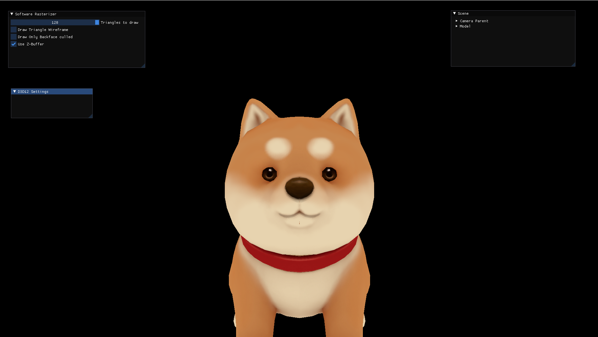
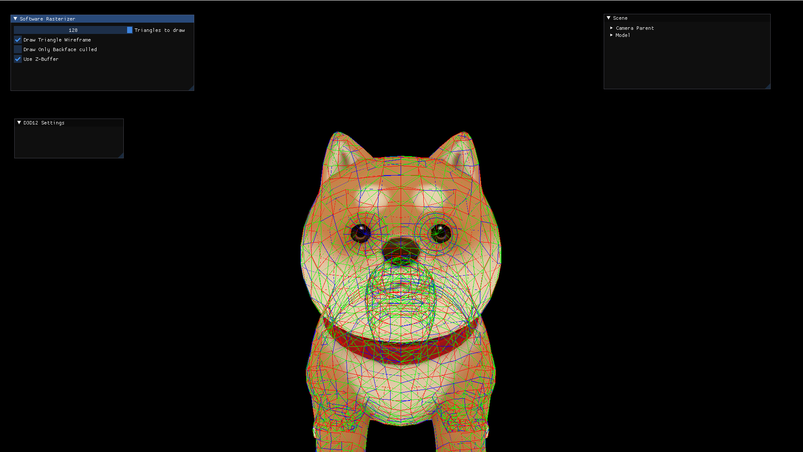
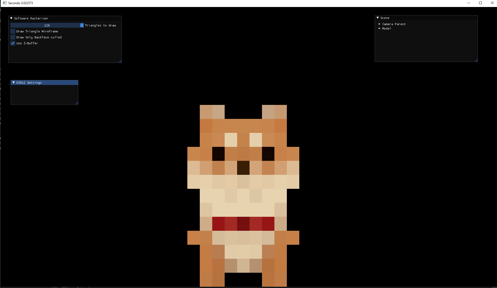

# Software-Rasterizer
A software rasterizer made for fun.

Draws everything into a R8G8B8A8 Texture and uses a D3D12 Backend (from GFramework) to display.

Can be built by executing "cmake .." in "build" directory.

